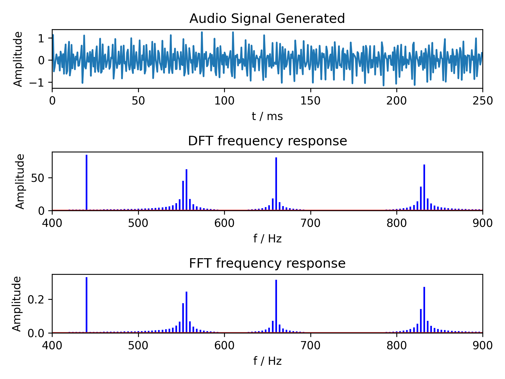

## Simple DFT and FFT algorithms without optimisation
### References:
- ["But what is the Fourier Transform? A visual introduction." By 3Blue1Brown](https://www.youtube.com/watch?v=spUNpyF58BY)
- ["The Fast Fourier Transform Algorithm" by Barry Van Veen](https://www.youtube.com/watch?v=EsJGuI7e_ZQ)

## Results

```
DFT on buffer of 512 took 0.692591099999845s
FFT on buffer of 512 took 0.015736600005766377s
```